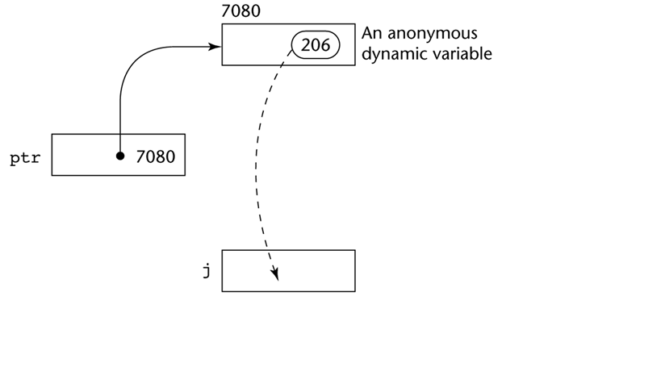
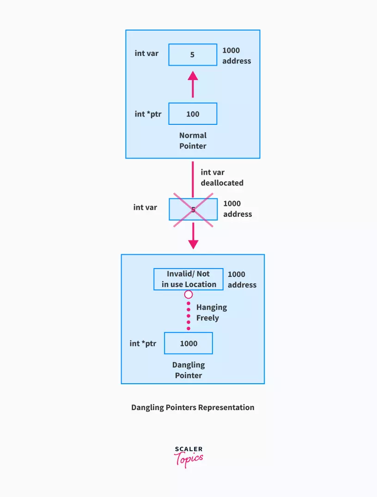

# **Final Preparation**

## L5, L6.1, L6.2

1.  What do you mean by binding? what are the possible binding times?

    Answer:

    **Binding**: A binding is an association between an entity and an attribute, such as between a variable and its type or value, or between an operation and a symbol.

    **Binding time**: is the time at which a binding takes place.

    **Possible Binding times**:

    - Language design time: bind operator symbols to operations
    - Language implementation time: bind floating point type to a representation.
    - Compile time: bind a variable to a type in C or Java.
    - Load time: bind a C/C++ stattic variable to a memory cell.
    - Runtime: bind a nonstatic local variable to a memory cell.

2.  Differentiate between static and dynamic binding.

    Answer:

    **Static binding**: A binding is static if it first occurs before run time and remains unchanged throughout program execution.

    **Dynamic binding**: A binding is dynamic if it first occurs during execution or can change during execution of the program.

3.  Differentiate between explicit and implicit binding.

    Answer:

    **Explicit decralation**: is a statement in a program that lists variable names and specifies that they are a particular type.

    **Implicit declaration**: is a default mechanism for specifying types of variables through default conventions, rather than declaration statements.

    **Examples**: Fortran, BASIC, Perl, Ruby, JavaScript, and PHP provide implicit declarations (Fortran has both explicit and implicit)

4.  What are the categories of variables based on lifetimes?

    Answer:

    1. **Static**: Bound to memory cells before execution begins and remains bound to the same momory cell throughout execution, e.g., C/C++ static variables in functions.

       - Advantages: efficiency (direct addressing), history-sensitive subprogram support.
       - Disadvantages:lack of flexibility (no recursion)

    2. **Stack-dynamic**: Storage bindings are created for variables when their declaration statements are elaborated, but whose types are statically bound. (A declaration is elaborated when the executable code associated with it is executed).

       - local variables in C subprograms(not declared static) and java methods.
       - Advantage: Allows recursion; conserves storage.
       - Disadvantages: Overhead of allocation and deallocation; subprograms cannot be history sensitive; inefficient references (indirect addressing).

    3. **Explicit heap-dynamic**: Explicit heap- dynamic variables are nameless (abstract) memory cells that are allocated and deallocated by explicit run-time instructions written by the programmer. These variables, which are allocated from and deallocated to the heap, can only be referenced through pointer or reference variables. For example: In C++ `new` and `delete` is used for allocation and deallocation.

       ```cpp
       int *intnode; // create a pointer
       int node = new int; //create the heap-dynamic variable
       ...
       delete intnode; //Deallocate the heap-dunamic variable to which intnode points.
       ```

       - Advantage: Provides for dynamic storage management.
       - Disadvantage: inefficient and unreliable

    4. **Implicit heap-dynamic**: Implicit heap-dynamic variables are bound to heap storage only when they are assigned values. In fact, all their attributes are bound every time they are assigned. For example:

       ```javascript
       highs = {23, 52, 34, 69, 93};

       ```

    It Regardless of whether the variable named `highs` was previously used iin the program or what it was used for, it is now an array of five numveric values. - Advantage: flexibility (generic code) - Disadvantage: Inefficient, because all attributes are dynamic; Loss of error detection.

5.  What do you mean by scope of variable? differentiate between global and local variable.

    Answer:

    **Scope of variable**: The **scope** of a variable is the range of statements in which the variable is visible.

    **Local variable**: A variable is local in a program unit or block if it is declared there.

    **Global variable**: Global variables are a special category of nonlocal variables. The nonlocal variables of a program unit are those that are visible in the unit but not declared there.

6.  What are the primitive data types? Explain the IEEE floating point standard 754.

    Answer:

    **Primitive data types**: Those not defined in terms of other data types. Some primitive data types are merely reflections of the hardware.Others require only a little non-hardware support for their implementation. Some Primitive data types:

    1. Integer:

       1. exact reflection of the hardware so the mapping is trivial.
       2. as many as eight different integer types in a language.
       3. java's signed integer sizes: `byte`, `short`, `int`, `long`

    2. Floating point:

       1. Model real numbers, but only as approximations
       2. Language used for scientific usage have at least two floating point types (`float`, `double`)
       3. Usually like hardware, but not always.

       IEEE Floating-Point Standard 754 Representation:
       

    3. Complex:

       1. Some lang support complex type, eg: `C99`, `Fortran`, and `Python`
       2. Each value consists fo two floats, the `real` and the `imaginary` part.
       3. Literal form (in python) `7 + 3j`; where 7 is real and 3 is imaginary.

    4. Decimal:

       1. For business applications (money)
          1. Essential to COBOL
          2. C# offers a decimal data type
       2. store a fixed number of decimal digits (Coded in BCD).
       3. Advantage: Accuracy
       4. Disadvantages: limited range, wastes memory

    5. Boolean:

       1. Simplest of all
       2. Range of values: 2 elements `true`, or `false`
       3. could be implemented as bits, but often as bytes

    6. Character:

       1. Stored as numeric codings
       2. Most commonty used coding: `ASCII`
       3. An alternative, 16-bit coding `unicode`

7.  Explain different types of strings in different languages with the string operation.

    Answer:

    1. `C/C++`: Not primitive.
    2. `SNOBOL4`:Primitive.
    3. `Fortran and Python`: Primitive.
    4. `Java`:Primitive via the `String` class.
    5. `Perl, JavaScript, Ruby and Python`: Provide built-in patter matching, using regular expressions.

8.  Explain different types of enumarated data types with example.
9.  Explain array data type with its indexing, binding, intitialization and heterogenity.

    Answer:

    **Array Types**: An array is a homogeneous aggreagate of data elements in which an individual element is identified by its position in the aggregate, relative to the first element.
    **Array indexing**: Indexing (or subscripting) is a mapping from indices to elements.

    ```cpp
    array_name(index_value_list) -> an element
    ```

    **Index Syntax**: Fortran and Ada use parentheses; Most other languages use brackets.
    **Subscript binding**: The binding of the subscript type to an array variable is useally static, but the subscript value ranges are sometimes dynamically bound. there are four categories of arrays, based on the binding to subscript ranges, the binding to sttorage, and from where the storage is allocated.

    1. Static array: The subscript ranges are static, the storage is static, and the storage is allocated statically.
    2. Fixed stack-dynamic array: The subscript ranges are static bound, but the declaration is done at declaration time.
       - Advantage: space efficiency.
    3. Heap-dynamic: Subscript ranges are dynamically bound and the storage allocation is dynamic (done at runtime).The array can be changed any number of times.
       - Advantage: Flexibility (the size of an array need not be known until the array is to be used).
    4. Fixed heap-dynamic array: Similar to fixed stack dynamic; storage binding is dynamic but fixed after allocation.

    **Array Initialization**: Some language allow initialization at the time of storage allocation.

    1. C, C++, Java, C#:

       ```java
        int list[] = {3, 4, 56, 23};
       ```

    2. Character strings in C and C++:

       ```C++
       char name [] = "Sifat";
       ```

    **Heterogeneous Arrays**:

    A heterogeneous array is one in which the elements need not be of the same type. Supported by `Perl, Python, JavaScript,` and `Ruby`.

10. How is two dimensional/multidimensional array implemented?

    Answer:

    ```cpp
    // Different ways to initialize two-dimensional array

    int c[2][3] = {{1, 3, 0}, {-1, 5, 9}};

    int c[][3] = {{1, 3, 0}, {-1, 5, 9}};

    int c[2][3] = {1, 3, 0, -1, 5, 9};
    ```

11. What do yo mean by record data type? What operations are allowed for record data types?

    Answer:

    **Record**: A record is a possibly heterogeneous aggregate of data elements in which the inidividual elements are identified by names.

    **Operations on Records**:

    - Assignment is very common if the types are identical.
    - Ada Allows record comparison
    - Ada records can be initialized with aggregate literals
    - COBOL proviles `MODE CORRESPONDING`
      - Copies a field of the source record to the corresponding field in the target record.

12. How is a record data type implemented? Explain with example.

    Answer:

    **Record Type Implementation**: Offset address relative to the beginning of the records is associated with each field.
    

13. Explain list data with example.

    Answer:

    **Lists in LISP**:

    - Lists in LISP and Scheme are delimited by parentheses and use no commas (A B C D) and (A (B C) D)

    - Data and code have the same form
    - As data, (A B C) is literally what it is
    - As code, (A B C) is the function A applied to the parameters B and C
    - The interpreter needs to know which a list is, so if it is data, we quote it with an apostrophe
      ′(A B C) is data

    **List Operations in Scheme**:

    - CAR returns the first element of its list parameter (CAR ′(A B C)) returns A
    - CDR returns the remainder of its list parameter after the first element has been removed (CDR ′(A B C)) returns (B C)

    - CONS puts its first parameter into its second parameter, a list, to make a new list (CONS ′A (B C)) returns (A B C)

    - LIST returns a new list of its parameters (LIST ′A ′B ′(C D)) returns (A B (C D))

    **Lists in Python**:

    - The list data type also serves as Python’s arrays
    - Unlike Scheme, Common LISP, ML, and F#, Python’s lists are mutable
    - Elements can be of any type
    - Create a list with an assignment
      myList = [3, 5.8, "grape"]
    - List elements are referenced with subscripting, with indices beginning at zero

    ```python
     x = myList[1]    #Sets x to 5.8
    ```

    - List elements can be deleted with del

    ```python
    del myList[1]
    ```

    - List Comprehensions – derived from set notation
      `[x * x for x in range(6) if x % 3 == 0]`
      range(12) creates `[0, 1, 2, 3, 4, 5, 6]`
      Constructed list: `[0, 9, 36]`

14. How does Union data type differ from record?

    Answer:

    **Union Type**: A `union` is a type whose variables are allowed to store different type values at different times during execution.

    **TODO: NOT COMPLETE YET!**

15. What are the speciality of pointer/reference data type? What are the operations allowed for pointer type data? Explain with example.

    Answer:

    **Pointer Type**: A pointer type variable has a range of values that consists of memory addresses and a special value, nil

    - Provide the power of indirect addressing.
    - Provide a way to manage dynamic memory.
    - A pointer can be used to access a location in the area where storage in dynamically created (useally called a heap)

    - Two fundamental operations: assignment and dereferencing
    - Assignment is used to set a pointer variable's value to some useful address.
    - Dereferenciing yields the value stored at the location represented by the pointer's value.

      - Dereferencing can be explicit or implicit
      - C++ uses an explicit operation via \*

        ```C++
            j = *ptr
        ```

        sets j to the value located at ptr.
        **The assignment operation `j` `=` `*pts`**
        

16. What are the main problems with pointer?

    Answer:

    **Problems with pointers**:

    1. Dangling Pointers (Dangerous)

       - A pointer points to a heap-dynamic variable that has been deallocated

    2. Lost heap-dynamic variable

       - An allocated heap-dynamic variable that is no longer accessible to the user program (often called `garbage`)
         - Pointer p1 is set to point to a newly created heap-dynamic variable.
         - Pointer p1 is later set to point to another kewly created heap-dynamic variable.
         - The process of losing heap-dynamic varaibles is called `memory leakage`.

    3. Some dangling pointers are disallowed because dynamic objects can be automatically deallocated at the end of pointer's type scope.
    4. The lost heap-dynamic variable problem is not eliminated by Ada ( possible with `UNCHECKED_DEALLOCATION`)

17. Explain dangling pointer with example.

    Answer:

    The pointers pointing to a deallocated memory block are known as Dangling Pointers. This condition generates an error known as Dangling Pointer Problem. Dangling Pointer occurs when a pointer pointing to a variable goes out of scope or when an object/variable's memory gets deallocated.

    

    ```C++
    // Dangling Pointers using dynamic memory allocation
    #include <stdio.h>
    #include <stdlib.h>

    int main() {
        // 4 bytes of int memory block (64bit compiler)
        // allocated using malloc() during runtime
        int *ptr = (int *)malloc(sizeof(int)); // normal pointer

        *ptr = 10;

        // memory block deallocated using free() function
        free(ptr);


        // here ptr acts as a dangling pointer
        printf("%d", *ptr);
        // prints garbage value in the output console

        return 0;
    }
    ```

18. What do you mean type checking? Explain coersion rules with example.

    Answer:

    **Type Chekcking**:

    - `Type Checking` is the activity of ensuring that the operands of an operator are of compatible types.
    - A `compatible type` is one that is either legal for the operator, or is allowed under language rules to be implicitly converted, by compiler-generated code, to a legal type.
      - This automatic conversion is called a `coercion`.
    - A `type error` is the application of an operator to an operand of an inappropriate type.
    - If all type bindings are static, nearly all type checking can be static.
    - If type bindings are dynamic, type checking must be dynamic.
    - A programming language is strongly typed if type errors are always detected
    - Advantage of strong typing: Allows the detection of the misuses of variables that result in type errors.

## L7, L8

19. Explain different types of operators and precedence and associativity.

    Answer:

    **Operator precedence rules**:

    - The operator `precedence rules` for expression evaluation define the order in which "adjacent" operators of different precedence levels are evaluated.
    - Typical precedence level

      - parentheses
      - unary operators
      - \*\* (if the language supports it)
      - \*,/
      - +,-

      **Associativity Rule**:

      - The `operator associativity rules` for expression evaluation defin ethe order in which adjacent operators with the same precedence level are evaluated.
      - Typical associativity rules
        - Left to right, except \*\*, which is right to left
        - Sometimes unary operators associate right to left (e.g., in FORTRAN)
        - APL is different; all operators have equal precedence and all operators associate right to left
        - Precedence and associativity rules can be overriden with parenthese.

20. Explain the conditional expressions with example.

    Answer:

    **Conditional Expressions**:

    - C-based languages (e.g, C/C++)
    - An example:

    ```C++
       average = (count == 0)? 0: sum/count
    ```

    - Evaluates as if written as follows

    ```C++
       if (count == 0)
           average = 0
       else
       average = sum/count
    ```

21. Explain the referential transparency or common subexpression elemination with example.

    Answer:

    **Referential Transparency**:

    A program has the property of referential transparency if any two expressions in the program that have the same value can be substituted for one another anywhere in the program, without affecting the action of the program. The value of a referentially transparent function depends entirely on its parameters. The connection of referential transparency and functional side effects is illustrated by the following example

    ```JavaScript

    result1 = (fun(a) + b) / (fun(a) - c);
    temp = fun(a);
    result2 = (temp + b) / (temp - c);
    ```

    If the function `fun` has no side effects, `result1` and `result2` will be equal, because the expressions assigned to them are equivalent. However, suppose fun has the side effect of adding 1 to either `b` or `c`. Then `result1` would not be equal to `result2`. So, that side effect violates the referential transparency of the program in which the code appears.

22. What do you mean by operator overloading? Explain with example.

    Answer:

    **Overloaded Operators**:

    - Use of an operator for more than one purpose is called `operator overloading`.
    - some are common (e.g., + for `int` and `float`)
    - Some are potential trouble (e.g., \* in C and C++)
      - Loss of compiler error detection (omission of an operand should be a detectable error)
      - Some loss of readability
    - C++, C#, adn F# allow user-defined overloaded operators
      - When sensibly used, such operators can be an aid to readability (avoid method calls, expressions appear natural)
      - Protential problems:
        - Users can define cnonsense operations
        - Readability may suffer, even when the operators make sense.

23. Explain different types of type conversions with example.

    Answer:

    **Type conversions**:

    - A **narrowing conversion** converts a value to a type that cannot store even approximations of all of the values of the original type. For example, converting a double to a float in Java is a narrowing conversion, because the range of double is much larger than that of float.
    - A **widening conversion** converts a value to a type that can include at lease approximations of all the values of the original type. For example, converting an int to a float in Java is a widening conversion.

24. Explain different types of assignment statements (Conditional targets and multiple assignments).

    Answer:

    **Conditional targets(PERL)**

    ```Php
    ($flag ? $total: $subtotal) = 0
    ```

    which is equivalet to

    ```C++
    if ($flag){
        $total = 0
    }else {
        $subtotal = 0
    }
    ```

    **Multiple Assignments**

    - Perl, Ruby, and lua allow multiple-target multiple-source assignments

    ```C++
        ($first, $second, $third) = (20,30,40)
    ```

25. Write down different types of control statement.

    Answer:
    **TODO: CAN CHECK LATER**

26. Explain nested if-then-else statements with example.

    Answer:

    The if-then-else statement provides a secondary path of execution when an "if" clause evaluates to false. You could use an if-then-else statement in the applyBrakes method to take some action if the brakes are applied when the bicycle is not in motion. In this case, the action is to simply print an error message stating that the bicycle has already stopped.

    ```Java
        void applyBrakes() {
            if (isMoving) {
                currentSpeed--;
            } else {
                System.err.println("The bicycle has already stopped!");
            }
        }
    ```

27. How is a switch-case statement can be converted to if-then-else statement? Explain with example.

    Answer:
    **TODO: CAN CHECK LATER**

28. Explain different types of loop statements in C/C++ with example.

    Answer:
    **TODO: CAN CHECK LATER**

29. What are the use of "break" and continue statement in C/C++? Explain with example.

    Answer:
    **TODO: CAN CHECK LATER**

## L9.1, L9.2

30. Define subprogram, subprogram call and parameter profile.

    Answer:

    **subprogram**: A subprogram definition describes the interface to and the actions of the ssubprogram abstraction.
    1. Each subprogram has a single entry point.
    2. the calling program unit is supended during the execution of the suprogram, which implies that there is only one subprogram in execution at any given time.
    3. Control always returns to the caller when the subprogram execution terminates.

    **subprogram call**: is the explicit request that a specific subprogram be executed.
    **parameter profile (aka signature)**: of a subprogram is the number, order, and types of its parameters.

31. Differentiate between formal parameter and actual parameter.

    Answer:

    **formal Parameter**:
    - A `formal parameter` is a dummy variable listed in the subprogram header and used in the subprogram.

    **actual Parameter**:
    - represents a value or address used in the subprogram call statement.

32. Differentiate between procedure and function.

    Answer:

    There are two categories of subprograms
    - **Procedures**: are collection of statements that define parameterized computations.
    - **Functions**: structurall resemble procedures but are semantically modeled on mathematical functions
      - They are expected to produce no side effects
      - In practice, program functions have side effects.

33. Explain different types of parameter passing with example.

    Answer:

    **Types of parameter passing**:
    - In mode
    - Out mode
    - Inout mode
    

34. Differentiate between pass-by-values, pass by variable reference and pass by name.

    Answer:

    **Pass by value**:
    **Pass by Reference**:
    **Pass by name**:

35. Explain call semantics and return semantics.

    Answer:

    **Call Semantics** :
    - Save the execution status of the caller
    - Pass the parameters
    - Pass the return address to the called
    - Transfer control to the called

    **Return semantics**:
    - If pass-by-value-resulr or out more parameters are used, move the current values of those parameters to their corresponding actual parameters
    - If it is a function, move the functional value to a place the caller can get it
    - Restore the execution status of the caller
    - Transfer control back to the caller.

36. What do you mean by activation record? Explain with example in C/C++.

    Answer:
    **Activation record**:
    The format, or layout, of the non-code part of an executing subprogram is called an activation record.

37. Explain the activation record of recursion fatorial function/recursive fibonacci number.
38. Explain the nested subprogram with example.

## L10, L11

39. What do you mean by abstract data type(ADT)? What are the conditions of ADT?
40. What are the advantages of ADT?
41. What do you mean by encapsulation? How can information be hided in C++? Explain with example.
42. What are the uses of constructor and destructor?
43. Write down the stck ADT in C++.
44. What do you mean by friend function/class?
45. What do you mean by inheritance in C++?
46. What do you mean by abstract method/class?
47. Differentiate between subclass and superclass.
48. What do you mean by single and multiple inheritance? Explain with Example.
49. Differentiate between operator and functional overloading. Explain with example.
