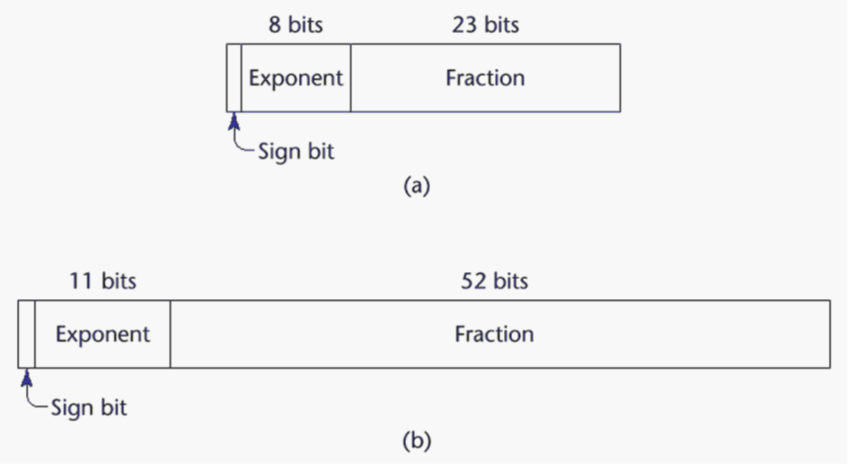

# **Final Preparation**

## L5, L6.1, L6.2

1.  What do you mean by binding? what are the possible binding times?

    Answer:

    **Binding**: A binding is an association between an entity and an attribute, such as between a variable and its type or value, or between an operation and a symbol.

    **Binding time**: is the time at which a binding takes place.

    **Possible Binding times**:

    - Language design time: bind operator symbols to operations
    - Language implementation time: bind floating point type to a representation.
    - Compile time: bind a variable to a type in C or Java.
    - Load time: bind a C/C++ stattic variable to a memory cell.
    - Runtime: bind a nonstatic local variable to a memory cell.

2.  Differentiate between static and dynamic binding.

    Answer:

    **Static binding**: A binding is static if it first occurs before run time and remains unchanged throughout program execution.

    **Dynamic binding**: A binding is dynamic if it first occurs during execution or can change during execution of the program.

3.  Differentiate between explicit and implicit binding.

    Answer:

    **Explicit decralation**: is a statement in a program that lists variable names and specifies that they are a particular type.

    **Implicit declaration**: is a default mechanism for specifying types of variables through default conventions, rather than declaration statements.

    **Examples**: Fortran, BASIC, Perl, Ruby, JavaScript, and PHP provide implicit declarations (Fortran has both explicit and implicit)

4.  What are the categories of variables based on lifetimes?

    Answer:

    1. **Static**: Bound to memory cells before execution begins and remains bound to the same momory cell throughout execution, e.g., C/C++ static variables in functions.

       - Advantages: efficiency (direct addressing), history-sensitive subprogram support.
       - Disadvantages:lack of flexibility (no recursion)

    2. **Stack-dynamic**: Storage bindings are created for variables when their declaration statements are elaborated, but whose types are statically bound. (A declaration is elaborated when the executable code associated with it is executed).

       - local variables in C subprograms(not declared static) and java methods.
       - Advantage: Allows recursion; conserves storage.
       - Disadvantages: Overhead of allocation and deallocation; subprograms cannot be history sensitive; inefficient references (indirect addressing).

    3. **Explicit heap-dynamic**: Explicit heap- dynamic variables are nameless (abstract) memory cells that are allocated and deallocated by explicit run-time instructions written by the programmer. These variables, which are allocated from and deallocated to the heap, can only be referenced through pointer or reference variables. For example: In C++ `new` and `delete` is used for allocation and deallocation.

       ```cpp
       int *intnode; // create a pointer
       int node = new int; //create the heap-dynamic variable
       ...
       delete intnode; //Deallocate the heap-dunamic variable to which intnode points.
       ```

       - Advantage: Provides for dynamic storage management.
       - Disadvantage: inefficient and unreliable

    4. **Implicit heap-dynamic**: Implicit heap-dynamic variables are bound to heap storage only when they are assigned values. In fact, all their attributes are bound every time they are assigned. For example:

       ```javascript
       highs = {23, 52, 34, 69, 93};

       ```

    It Regardless of whether the variable named `highs` was previously used iin the program or what it was used for, it is now an array of five numveric values. - Advantage: flexibility (generic code) - Disadvantage: Inefficient, because all attributes are dynamic; Loss of error detection.

5.  What do you mean by scope of variable? differentiate between global and local variable.

    Answer:

    **Scope of variable**: The **scope** of a variable is the range of statements in which the variable is visible.

    **Local variable**: A variable is local in a program unit or block if it is declared there.

    **Global variable**: Global variables are a special category of nonlocal variables. The nonlocal variables of a program unit are those that are visible in the unit but not declared there.

6.  What are the primitive data types? Explain the IEEE floating point standard 754.

    Answer:

    **Primitive data types**: Those not defined in terms of other data types. Some primitive data types are merely reflections of the hardware.Others require only a little non-hardware support for their implementation. Some Primitive data types:

    1. Integer:

       1. exact reflection of the hardware so the mapping is trivial.
       2. as many as eight different integer types in a language.
       3. java's signed integer sizes: `byte`, `short`, `int`, `long`

    2. Floating point:

       1. Model real numbers, but only as approximations
       2. Language used for scientific usage have at least two floating point types (`float`, `double`)
       3. Usually like hardware, but not always.

       IEEE Floating-Point Standard 754 Representation:
       

    3. Complex:

       1. Some lang support complex type, eg: `C99`, `Fortran`, and `Python`
       2. Each value consists fo two floats, the `real` and the `imaginary` part.
       3. Literal form (in python) `7 + 3j`; where 7 is real and 3 is imaginary.

    4. Decimal:

       1. For business applications (money)
          1. Essential to COBOL
          2. C# offers a decimal data type
       2. store a fixed number of decimal digits (Coded in BCD).
       3. Advantage: Accuracy
       4. Disadvantages: limited range, wastes memory

    5. Boolean:

       1. Simplest of all
       2. Range of values: 2 elements `true`, or `false`
       3. could be implemented as bits, but often as bytes

    6. Character:

       1. Stored as numeric codings
       2. Most commonty used coding: `ASCII`
       3. An alternative, 16-bit coding `unicode`

7.  Explain different types of strings in different languages with the string operation.

    Answer:

    1. `C/C++`: Not primitive.
    2. `SNOBOL4`:Primitive.
    3. `Fortran and Python`: Primitive.
    4. `Java`:Primitive via the `String` class.
    5. `Perl, JavaScript, Ruby and Python`: Provide built-in patter matching, using regular expressions.

8.  Explain different types of enumarated data types with example.
9.  Explain array data type with its indexing, binding, intitialization and heterogenity.

    Answer:
    **Array Types**: An array is a homogeneous aggreagate of data elements in which an individual element is identified by its position in the aggregate, relative to the first element.
    **Array indexing**: Indexing (or subscripting) is a mapping from indices to elements.

    ```cpp
    array_name(index_value_list) -> an element
    ```

    **Index Syntax**: Fortran and Ada use parentheses; Most other languages use brackets.
    **Subscript binding**: The binding of the subscript type to an array variable is useally static, but the subscript value ranges are sometimes dynamically bound. there are four categories of arrays, based on the binding to subscript ranges, the binding to sttorage, and from where the storage is allocated.

    1. Static array: The subscript ranges are static, the storage is static, and the storage is allocated statically.
    2. Fixed stack-dynamic array: The subscript ranges are static bound, but the declaration is done at declaration time.
       - Advantage: space efficiency.
    3. Heap-dynamic: Subscript ranges are dynamically bound and the storage allocation is dynamic (done at runtime).The array can be changed any number of times.
       - Advantage: Flexibility (the size of an array need not be known until the array is to be used).
    4. Fixed heap-dynamic array: Similar to fixed stack dynamic; storage binding is dynamic but fixed after allocation.

    **Array Initialization**: Some language allow initialization at the time of storage allocation.

    1. C, C++, Java, C#:

       ```java
        int list[] = {3, 4, 56, 23};
       ```

    2. Character strings in C and C++:

       ```C++
       char name [] = "Sifat";
       ```

    **Heterogeneous Arrays**:

    A heterogeneous array is one in which the elements need not be of the same type. Supported by `Perl, Python, JavaScript,` and `Ruby`.

10. How is two dimensional/multidimensional array implemented?
11. What do yo mean by record data type? What operations are allowed for record data types?
12. How is a record data type implemented? Explain with example.
13. Explain list data with example.
14. How does Unim data type differ from record?
15. What are the speciality of pointer/reference data type? What are the operations allowed for pointer type data? Explain with example.
16. What are the main problems with pointer?
17. Explain dangling pointer with example.
18. What do you mean type checking? Explain coersion null with example.

## L7, L8

19. Explain different types of operators and precedence and associativity.
20. Explain the conditional expressions with example.
21. Explain the referential transparency or common subexpression elemination with example.
22. What do you mean by operator overloading? Explain with example.
23. Exaplain different types of type conversions with example.
24. Explain different types of assignment statements (Conditional targets and multiple assignments).
25. Write down different types of control statement.
26. Explain nested if-then-else statements with example.
27. How is a switch-case statement can be converted to if-then-else statement? Explain with example.
28. Explain different types of loop statements in C/C++ with example.
29. What are the use of "break" and continue statement in C/C++? Explain with example.

## L9.1, L9.2

30. Define sybprogram, sybprogram call and parameter profile.
31. Differentiate between formal paramenter and actual parameter.
32. Differentiate between procedure and function.
33. Explain different types of parameter passing with example.
34. Differentiate between pass-by-values pass by variable reference and pass by name.
35. Explain call semantics and return semantics.
36. What do you mean by activation record? Explain with example in C/C++.
37. Explain the activation record of recursion fatorial function/recursive fibonacci number.
38. Explain the nested subprogram with example.

## L10, L11

39. What do you mean by abstract data type(ADT)? What are the conditions of ADT?
40. What are the advantages of ADT?
41. What do you mean by encapsulation? How can information be hided in C++? Explain with example.
42. What are the uses of constructor and destructor?
43. Write down the stck ADT in C++.
44. What do you mean by frind function/class?
45. What do you mean by inheritance in C++?
46. What do you mean by abstract method/class?
47. Differentiate between subclass and superclass.
48. What do you mean by single and multiple inheritance? Explain with Example.
49. Differentiate between operator and functional overloading. Explain with example.
